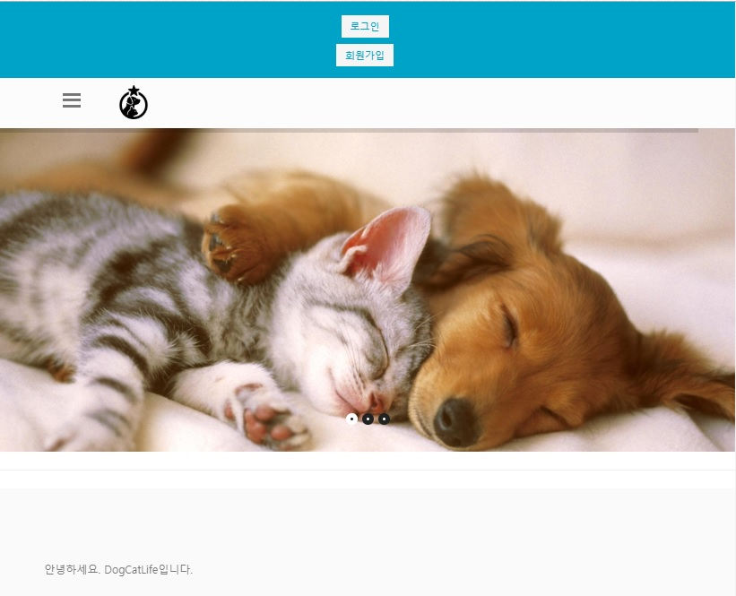
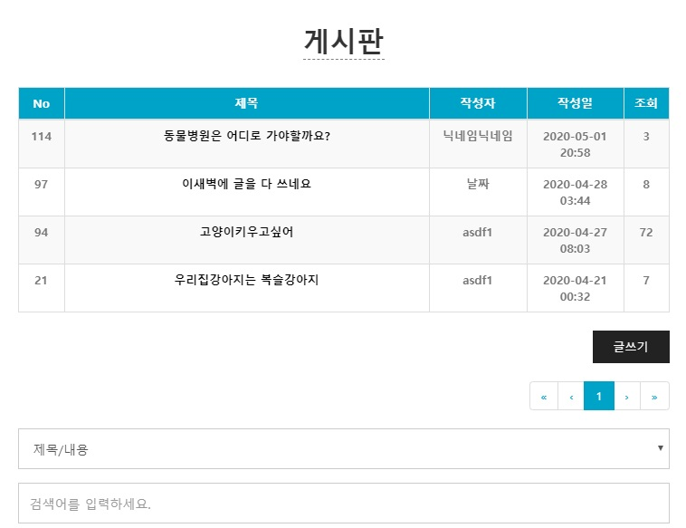
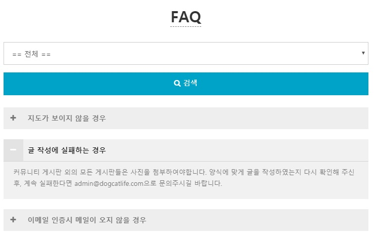

# TeamProject01-DogCatLife
> 2020.04 한달간 팀원들과 제작한 웹사이트입니다.
[관련ppt](https://github.com/YoonJeong-Choi/TeamProject01-DogCatLife/blob/master/%EC%84%9C%EB%A5%98/%EC%B5%9C%EC%9C%A4%EC%A0%95_%ED%8F%AC%ED%8A%B8%ED%8F%B4%EB%A6%AC%EC%98%A4-%EC%A7%91%EC%82%AC%EC%99%94%EB%83%A5%EB%A9%8D%EB%A9%8D.pptx)

애완인들의 커뮤니티 사이트로

jdk1.8, JSP, JavaScript, eclipse2019-12, tomcat8.0, spring framework, MariaDB 를 이용하여 사용자페이지를 담당하였습니다.

회원가입을 통하여 서비스를 사용할 수 있으며,

기본적인 게시판 형식으로 다른 사용자들과 소통하도록 되어있습니다.

[KakaoDevelopers](https://developers.kakao.com/)에서 제공해주는 지도 API를 이용하여 지도를 추가하였습니다.

관리자 페이지는 다른 팀원들과 아직 제작 중에 있으며 현재 완성된 부분 중

메인 하단부의 그래프 제작을 담당하였습니다.

그래프는 [Highcharts](https://www.highcharts.com/)의 API를 이용하였습니다.

또한, AWS로 배포하였습니다.(2020.05.08 서버 중지)

[DogCatLife](http://13.124.174.195/DogCatLife/)

[DogCatLifeAdmin](http://13.124.174.195/DogCatLife/admin_login.mysql)
